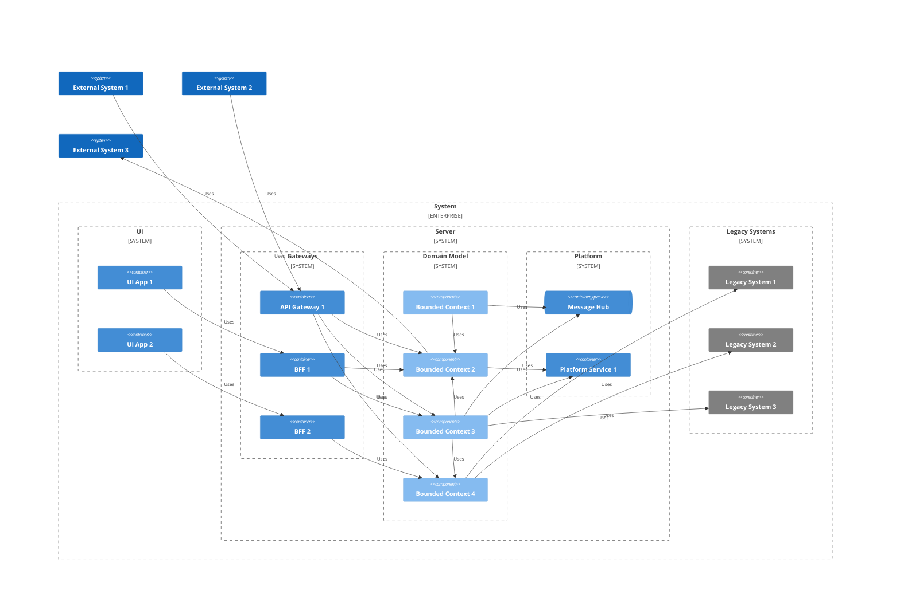
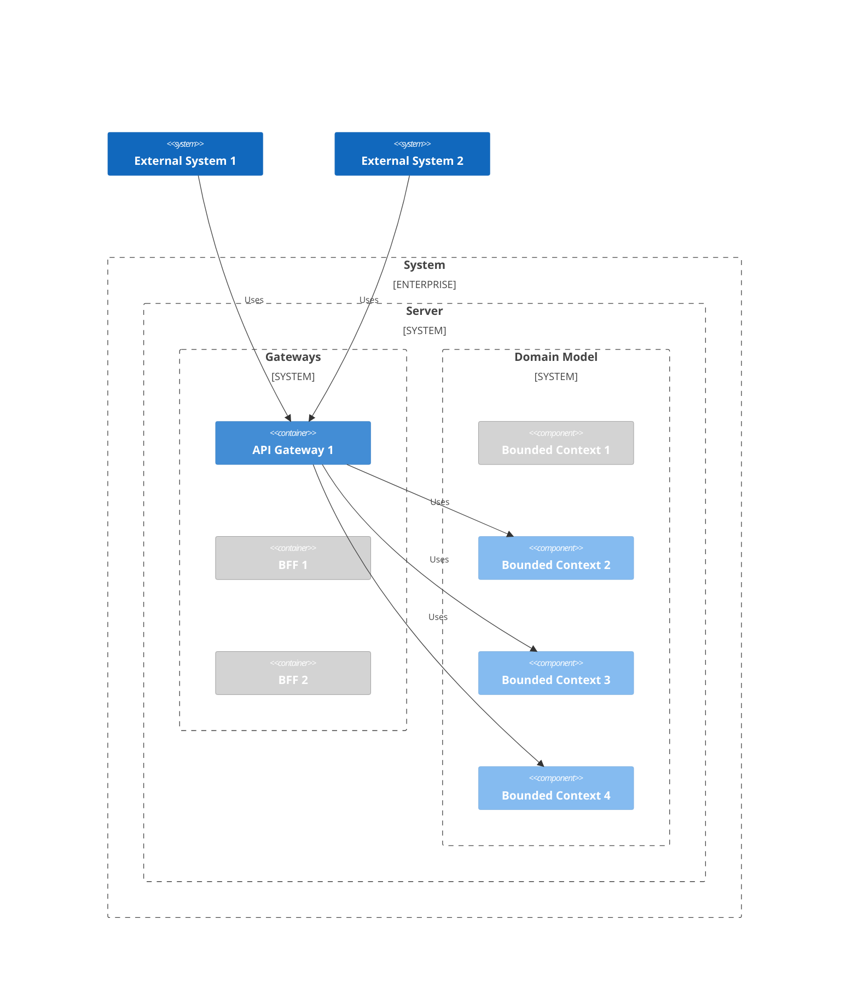
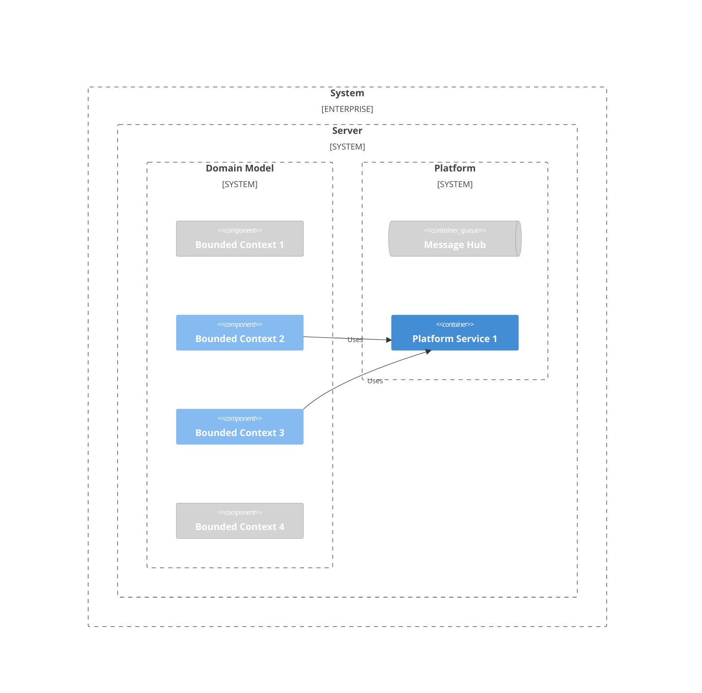
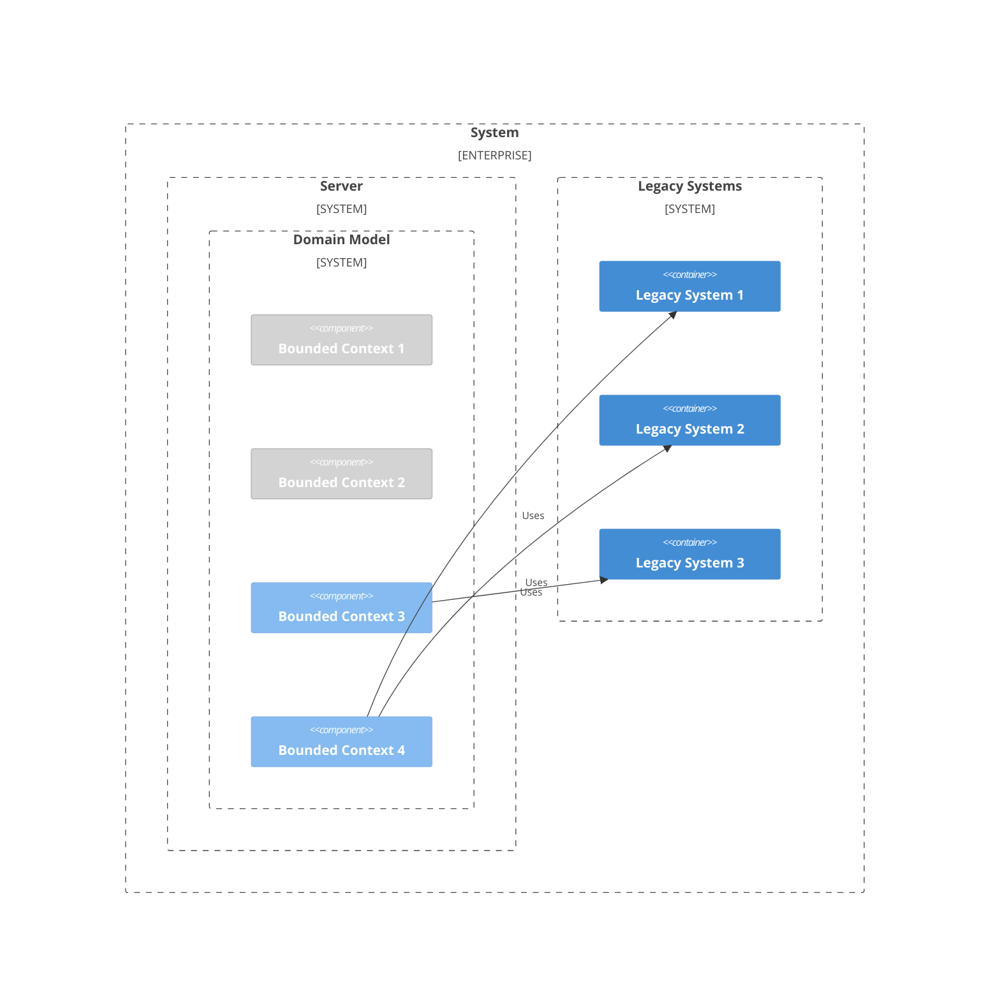
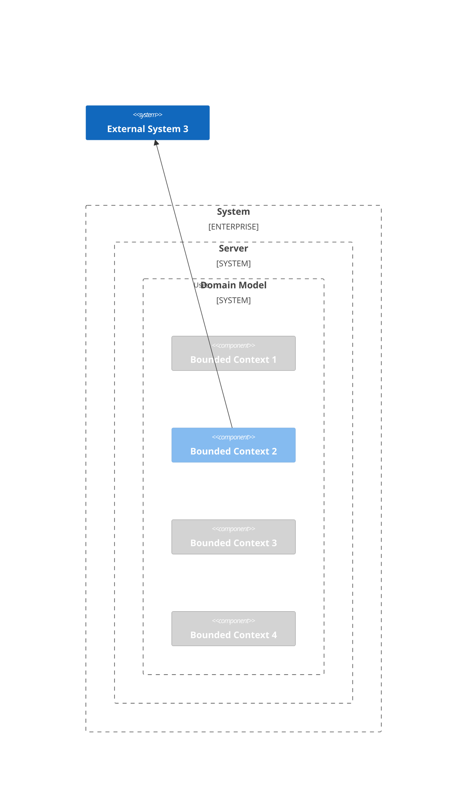
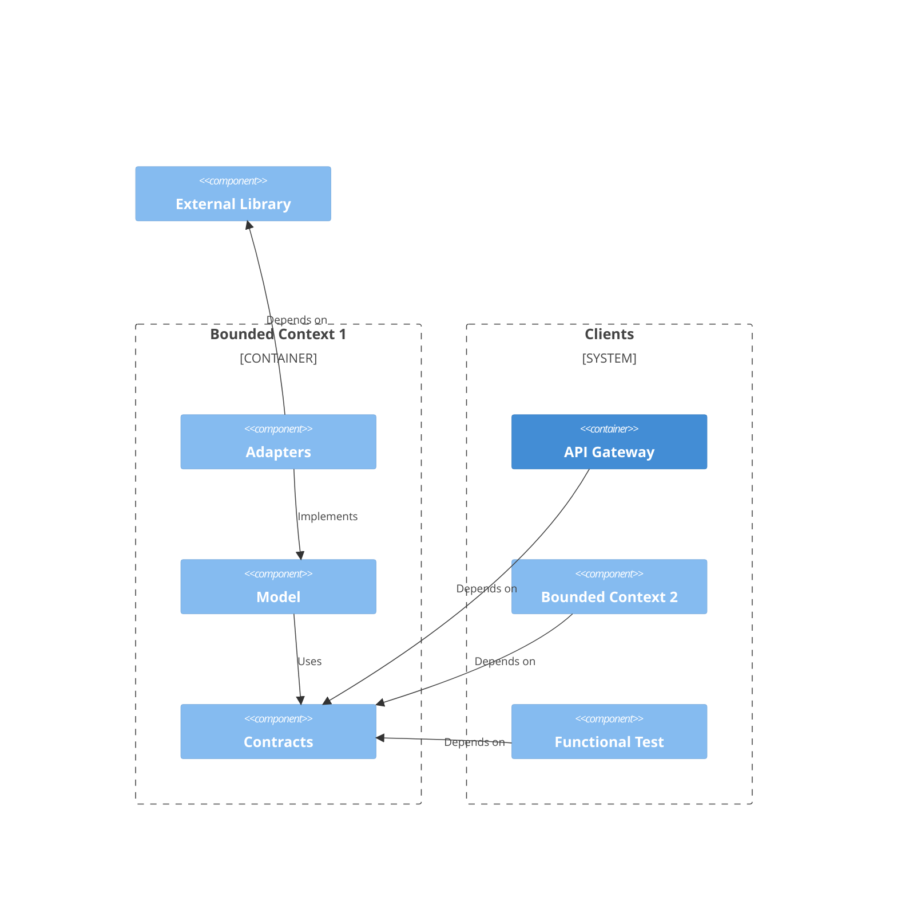
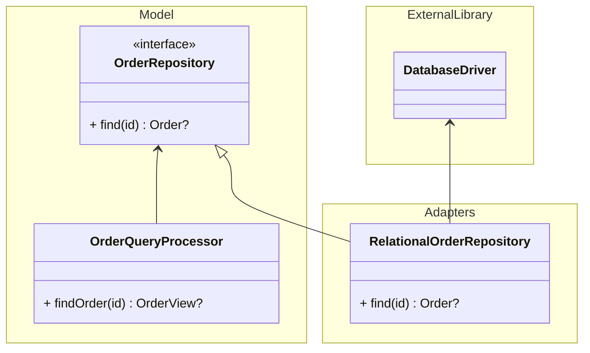
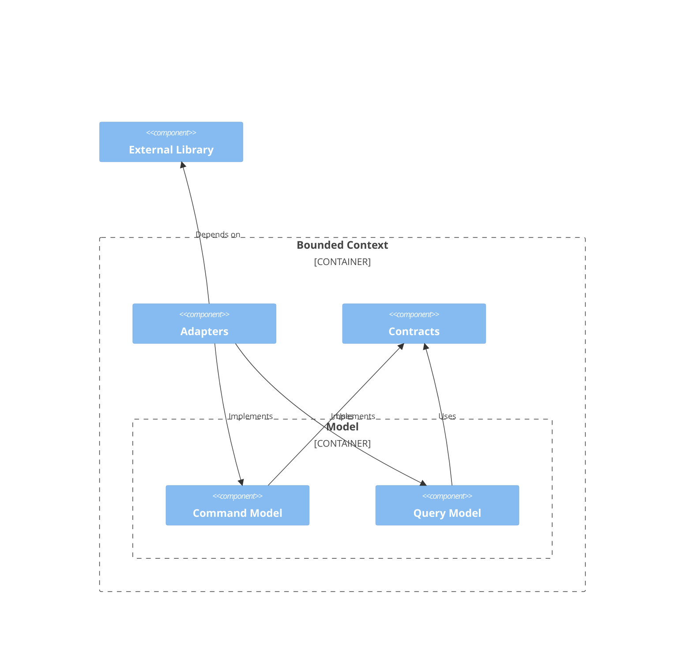
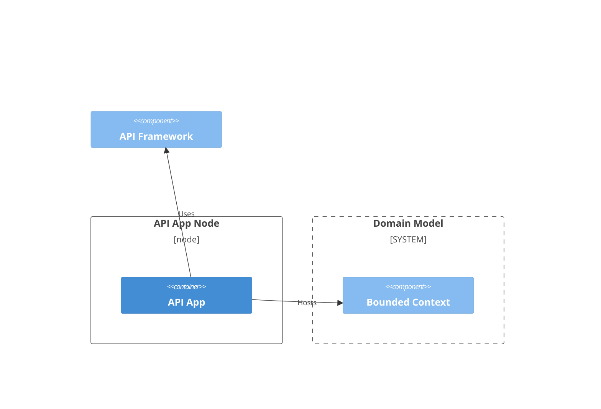

## 고수준 아키텍처 모델

작은 실험과 빠른 프로토타이핑을 위해 설계된 시스템이 덩치가 커지고 요구사항 복잡도가 올라가고 기여하는 엔지니어 수가 늘어나면 기존의 아키텍처는 점점 다양한 비효율과 문제를 일으킨다. 다음 단계로 성장하기 위해 시스템은 보다 구조화되어 관리될 필요가 있다. 이런 상황을 마주하고 있는 팀이 고려해 볼 만한 설계 기법들을 조합한 아키텍처 모델을 설명한다.



전체 시스템 다음 주요 영역으로 구분될 수 있다.

- **UI:** 시스템은 시스템을 사용하는 다양한 고객군을 대상으로 UI 응용프로그램을 제공한다. 예를 들어 쇼핑 서비스의 경우 구매자를 위한 모바일 응용프로그램과 판매자를 위한 웹 응용프로그램을 제공할 수 있다.

- **Domain Model:** 비즈니스 도메인의 문제를 해결하는 영역이다. 이 영역의 구성요소를 정의할 때 도메인 주도 설계의 Bounded Context는 좋은 도구다. Bounded Context를 기준으로 만들어진 구성요소는 정해진 맥락 하에서 담당한 문제에 집중할 수 있다.

- **Gateways:** Domain Model 영역에서 구현된 문제 해법을 시스템 외부에 노출하는 역할을 담당한다. 게이트웨이 응용프로그램은 외부 시스템을 위해 API를 공개할 수도 있고 각 UI 응용프로그램에 특화된 기능을 담당할 수도 있다. 후자의 기능을 담당하는 게이트웨이를 BFF(Backend for Frontend)라고 부른다.

- **Platform:** Domain Model 영역 구성요소를 지원하는 서비스가 구동된다.

- **Legacy Systems:** 폐기 예정이거나 더이상 외부에 노출되지 않지만 Domain Model 영역 구현에 재활용되는 시스템이 이 영역에 위치한다.

### BFF(Backend for Frontend)

특정 UI 응용프로그램을 지원할 목적으로 설계된 API 제공자이다. 핵심 구현은 Domain Model 영역에서 구현되기 때문에 BFF는 게이트웨이의 [Aggregation](https://learn.microsoft.com/en-us/azure/architecture/patterns/gateway-aggregation), [Offloading](https://learn.microsoft.com/en-us/azure/architecture/patterns/gateway-offloading), [Routing](https://learn.microsoft.com/en-us/azure/architecture/patterns/gateway-routing) 기능을 담당한다.

참고자료

- [Backends for Frontends pattern - Azure Architecture Center | Microsoft Learn](https://learn.microsoft.com/en-us/azure/architecture/patterns/backends-for-frontends)
- [Sam Newman - Backends For Frontends](https://samnewman.io/patterns/architectural/bff/)


### API 게이트웨이

Domain Model 영역에서 구현된 기능을 외부 시스템에 제공하기 위해 공개 API를 제공한다.

참고자료

- [API gateway pattern (microservices.io)](https://microservices.io/patterns/apigateway.html)



### Bounded Context 간 의존성

Bounded Context는 서로 협력해 더 큰 가치를 생산한다. 한 Bounded Context의 모델이 다른 Bounded Context의 모델에 의존할 때 직접 의존하지 않으며 메시지를 통해 정보를 주고받는 형태로 간접 의존한다. 메시지 교환은 추상화된 인터페이스를 통해 동기적으로 이뤄질 수도 있고 메시지 중개자를 통해 비동기적으로 이뤄질 수도 있다.


위 그림에서 Bounded Context 1은 Bounded Context 2에 동기적으로 메시지를 전달하는 반면, Bounded Context 1과 Bounded Context 3은 Message Hub를 통해 비동기적으로 메시지를 주고받으며 협력한다.

### 플랫폼 서비스

플랫폼 서비스는 여러 Bounded Context에 의해 재사용되는 기술 집약적 기능을 제공한다. 예를 들어 전역 범위의 유일성을 보장하는 엔터티 식별자를 생성하거나 암호화 기능을 제공할 수 있다.



### 레거시 시스템 사용

Bounded Context는 직접 비즈니스 도메인의 해법을 제공하는 것이 원칙이지만 현실적인 이유로 인해 해법 구현을 Legacy System에 위임할 수 있다. 예를 들어 Legacy System 자체는 폐기되었지만 포함된 기능 중 일부는 유용하고 재구현 비용이 비싸다면 Bounded Context의 인터페이스 설계에는 배제하되 구현에는 활용하는 것이 실용적일 수 있다.



### 외부 서비스 사용

시스템을 외부 시스템과 통합하는 방법으로 공개 API 제공할 수도 있지만 반대로 외부 시스템이 제공하는 API를 Bounded Context가 사용할 수도 있다. 이때 Bounded Context의 모델은 외부 시스템에 직접 의존하지 않으며 추상화된 인터페이스를 통해 간접 의존한다.



## Bounded Context

### Bounded Context 구성

**기본 구성**

일반적으로 Bounded Context는 하나의 모델을 포함한다. 이 경우 Bounded Context는 주요 구성요소 Contracts, Model, Adapters를 갖는다.



- **Contracts:** Bounded Context가 외부에 노출하는 인터페이스 계약에 사용되는 메시지와 데이터를 정의한다. Bounded Context의 직접 또는 간접 클라이언트는 오직 Contracts에 정의된 코드에만 직접 의존할 수 있다.

- **Model:** Bounded Context가 담당하는 도메인 모델이 표현된다. 문제 해법의 핵심 논리가 작성되며 전체 시스템 범위에서 가장 중요한 영역이다.

- **Adapters:** Model이 순수한 코드로 문제 해법을 구현할 수 있도록 기반 코드를 제공한다. 예를 들어 Model에 데이터 영속 장치에 대한 추상화가 정의되었다면 이 추상화의 구현체를 Adapters가 제공한다. Model이 다른 시스템에 의존할 때 의존 대상의 설계에 의해 Model이 훼손되지 않도록 [변질 방지 계층(Anti-Corruption Layer, ACL)](https://learn.microsoft.com/en-us/azure/architecture/patterns/anti-corruption-layer)이 포함될 수도 있다. 

주문을 조회 기능에 Repository 패턴이 적용되면 Model에 `OrderRepository` 인터페이스가 정의되고 `OrderQueryProcessor` 클래스가 `OrderRepository` 인터페이스에 의존해 `Order` 개체를 찾아 `OrderView` 개체로 변환해 반환하는 기능을 구현한다. Adapters는 외부 라이브러리가 제공하는 관계형 데이터베이스 드라이버를 사용해 `OrderRepository` 인터페이스를 구현한다. 이때 Model은 Adapters와 외부 라이브러리 어떤 것에도 의존하지 않기 때문에 적응력이 높아지고 테스트하기 쉬워진다.



**CQRS(Command and Query Responsibility Segregation)**

Bounded Context의 모델에 CQRS 패턴이 적용되면 단일 모델 구성의 Model 구성요소가 Command Model과 Query Model로 분리된다. Command Model은 도메인 모델의 명령 처리를, Query Model은 도메인 모델의 조회 처리를 표현한다.



### Bounded Context 호스팅

**단일 Bounded Context 호스팅**

Bounded Context는 Microservices 패턴에서와 같이 각각 하나의 독립된 호스트 응용프로그램에서 독립적으로 구동될 수 있다. Bounded Context에 독립된 자원을 할당하거나 다른 Bounded Context의 장애로부터 보호할 필요가 있을 때 적합하다.



**공유 호스트 응용프로그램**

여러 Bounded Context가 하나의 호스트 응용프로그램에서 구동될 수 있다. 공유된 호스트 응용프로그램에서 호스팅되는 Bounded Context들은 런타임, CPU, 메모리, 네트워크, 가용성 등을 공유한다.


**다중 호스트 응용프로그램**

하나의 Bounded Context가 둘 이상의 응용프로그램에서 호스팅 될 수 있다. 예를 들어 하나의 Bounded Context가 API 응용프로그램에서 호스팅 되어 동기적으로 요청을 처리하며 동시에 메시지 처리 응용프로그램에서 호스팅 되어 비동기적으로 요청을 처리하는 아키텍처도 가능하다.


## 코드 디렉터리

시스템 아키텍처가 고려된 코드 디렉터리 구조는 아키텍처를 이해하고 관리하는 데 큰 도움이 된다. 예를 들어 쇼핑 서비스 시스템은 아키텍처를 반영해 코드 디렉터리를 다음과 같이 설계할 수 있다.

```text
root/
┣ server/
┃ ┣ domain-model/
┃ ┃ ┣ accounting/
┃ ┃ ┃ ┣ adapters/
┃ ┃ ┃ ┣ contracts/
┃ ┃ ┃ ┣ model/
┃ ┃ ┃ ┗ unit-tests/
┃ ┃ ┣ identity/
┃ ┃ ┃ ┣ adapters/
┃ ┃ ┃ ┣ contracts/
┃ ┃ ┃ ┣ model/
┃ ┃ ┃ ┗ unit-tests/
┃ ┃ ┣ inventory/
┃ ┃ ┃ ┣ adapters/
┃ ┃ ┃ ┣ contracts/
┃ ┃ ┃ ┣ model/
┃ ┃ ┃ ┗ unit-tests/
┃ ┃ ┣ orders/
┃ ┃ ┃ ┣ adapters/
┃ ┃ ┃ ┣ api/
┃ ┃ ┃ ┣ contracts/
┃ ┃ ┃ ┣ infrastructure/
┃ ┃ ┃ ┣ model/
┃ ┃ ┃ ┣ processor/
┃ ┃ ┃ ┗ unit-tests/
┃ ┃ ┗ shared-hosts/
┃ ┃   ┣ api/
┃ ┃   ┣ infrastructure/
┃ ┃   ┣ processor/
┃ ┃   ┗ unit-tests/
┃ ┣ gateway/
┃ ┃ ┣ administration-bff/
┃ ┃ ┃ ┣ api/
┃ ┃ ┃ ┣ infrastructure/
┃ ┃ ┃ ┗ unit-tests/
┃ ┃ ┣ api-gateway/
┃ ┃ ┃ ┣ api/
┃ ┃ ┃ ┣ infrastructure/
┃ ┃ ┃ ┗ unit-tests/
┃ ┃ ┣ functional-tests/
┃ ┃ ┣ seller-bff/
┃ ┃ ┃ ┣ api/
┃ ┃ ┃ ┣ infrastructure/
┃ ┃ ┃ ┗ unit-tests/
┃ ┃ ┗ shopper-bff/
┃ ┃   ┣ api/
┃ ┃   ┣ infrastructure/
┃ ┃   ┗ unit-tests/
┃ ┗ platform/
┃   ┣ api/
┃   ┣ infrastructure/
┃   ┣ processor/
┃   ┗ unit-tests/
┗ ui/
  ┣ administration-frontend/
  ┃ ┗ web/
  ┣ seller-frontend/
  ┃ ┗ web/
  ┗ shopper-frontend/
    ┣ android/
    ┣ ios/
    ┗ web/
```
