# 스타트업 Architectural Runway 지침

나는 시리즈 B와 시리즈 C 전후 투자 단계에서 성장하는 복수의 스타트업에 참여하며 다음 단계로 나아가기 위해 마치 탈피의 고통처럼 겪는 기술 문제를 해결하기 위해 많은 기법들을 적용해 왔다. 이와 비슷한 상황에서 기술적 의사결정을 해야 하는 조직이 참고할 수 있도록 그동안의 경험 속에서 자주 반복되는 패턴들을 안내한다.

여기에 설명되는 다양한 모델은 정해진 답으로 제시된 것이 아니며 다양한 기술적 문제를 해결하는 과정의 한가지 힌트일 뿐이다. 모든 엔지니어는 각자가 마주하는 고유한 문제 상황에 대해 스스로 적절한 해결책을 선택할 책임이 있다.

만약 오류가 발견되거나 의문점이 생긴다면 누구나 issue를 등록하거나 pull request를 만들 수 있다.

> [Mermaid](https://mermaid.js.org) 특성상 어두운 테마에서 그림의 가시성이 떨어질 수 있기 때문에 밝은 테마를 권장한다.

## 진화 단계의 시스템 아키텍처 모델

작은 실험과 빠른 프로토타이핑을 위해 설계된 시스템이 덩치가 커지고 요구사항 복잡도가 올라가고 기여하는 엔지니어 수가 늘어나면 기존의 아키텍처는 점점 다양한 비효율과 문제를 일으킨다. 다음 단계로 성장하기 위해 시스템은 보다 구조화되어 관리될 필요가 있다. 이런 상황을 마주하고 있는 팀이 고려해 볼 만한 설계 기법들을 조합한 아키텍처 모델을 설명한다.

### 고수준 아키텍처 모델

가장 높은 시점에서 전체 시스템은 다음 주요 영역으로 구분될 수 있다.

- **UI:** 시스템은 시스템을 사용하는 다양한 고객군을 대상으로 UI 응용프로그램을 제공한다. 예를 들어 쇼핑 서비스의 경우 구매자를 위한 모바일 응용프로그램과 판매자를 위한 웹 응용프로그램을 제공할 수 있다.

- **Domain Model:** 비즈니스 도메인의 문제를 해결하는 영역이다. 이 영역의 구성요소를 정의할 때 도메인 주도 설계의 Bounded Context는 좋은 도구다. Bounded Context를 기준으로 만들어진 구성요소는 정해진 맥락 하에서 담당한 문제에 집중할 수 있다.

- **Gateways:** Domain Model 영역에서 구현된 문제 해법을 시스템 외부에 노출하는 역할을 담당한다. 게이트웨이 응용프로그램은 외부 시스템을 위해 API를 공개할 수도 있고 각 UI 응용프로그램에 특화된 기능을 담당할 수도 있다. 후자의 기능을 담당하는 게이트웨이를 BFF(Backend for Frontend)라고 부른다.

- **Platform:** Domain Model 영역 구성요소를 지원하는 서비스가 구동된다.

- **Legacy Systems:** 폐기 예정이거나 더이상 외부에 노출되지 않지만 Domain Model 영역 구현에 재활용되는 시스템이 이 영역에 위치한다.


#### BFF(Backend for Frontend)

특정 UI 응용프로그램을 지원할 목적으로 설계된 API 제공자이다. 핵심 논리는 Domain Model 영역에서 구현되기 때문에 BFF는 게이트웨이의 [Aggregation](https://learn.microsoft.com/en-us/azure/architecture/patterns/gateway-aggregation), [Offloading](https://learn.microsoft.com/en-us/azure/architecture/patterns/gateway-offloading), [Routing](https://learn.microsoft.com/en-us/azure/architecture/patterns/gateway-routing) 기능을 담당한다.

참고자료

- [Backends for Frontends pattern - Azure Architecture Center | Microsoft Learn](https://learn.microsoft.com/en-us/azure/architecture/patterns/backends-for-frontends)
- [Sam Newman - Backends For Frontends](https://samnewman.io/patterns/architectural/bff/)

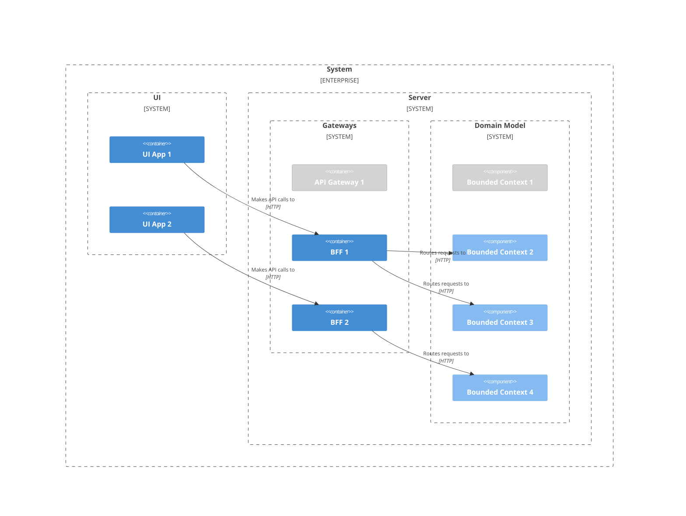

#### API 게이트웨이

Domain Model 영역에서 구현된 기능을 외부 시스템에 제공하기 위해 공개 API를 제공한다. API 게이트웨이는 [Aggregation](https://learn.microsoft.com/en-us/azure/architecture/patterns/gateway-aggregation), [Offloading](https://learn.microsoft.com/en-us/azure/architecture/patterns/gateway-offloading), [Routing](https://learn.microsoft.com/en-us/azure/architecture/patterns/gateway-routing) 기능을 담당한다.

참고자료

- [API gateway pattern (microservices.io)](https://microservices.io/patterns/apigateway.html)


#### Bounded Context 간 의존성

Bounded Context는 서로 협력해 더 큰 가치를 생산한다. 한 Bounded Context의 모델이 다른 Bounded Context의 모델에 의존할 때 직접 의존하지 않으며 메시지를 통해 정보를 주고받는 형태로 간접 의존한다. 메시지 교환은 추상화된 인터페이스를 통해 동기적으로 이뤄질 수도 있고 메시지 중개자를 통해 비동기적으로 이뤄질 수도 있다.

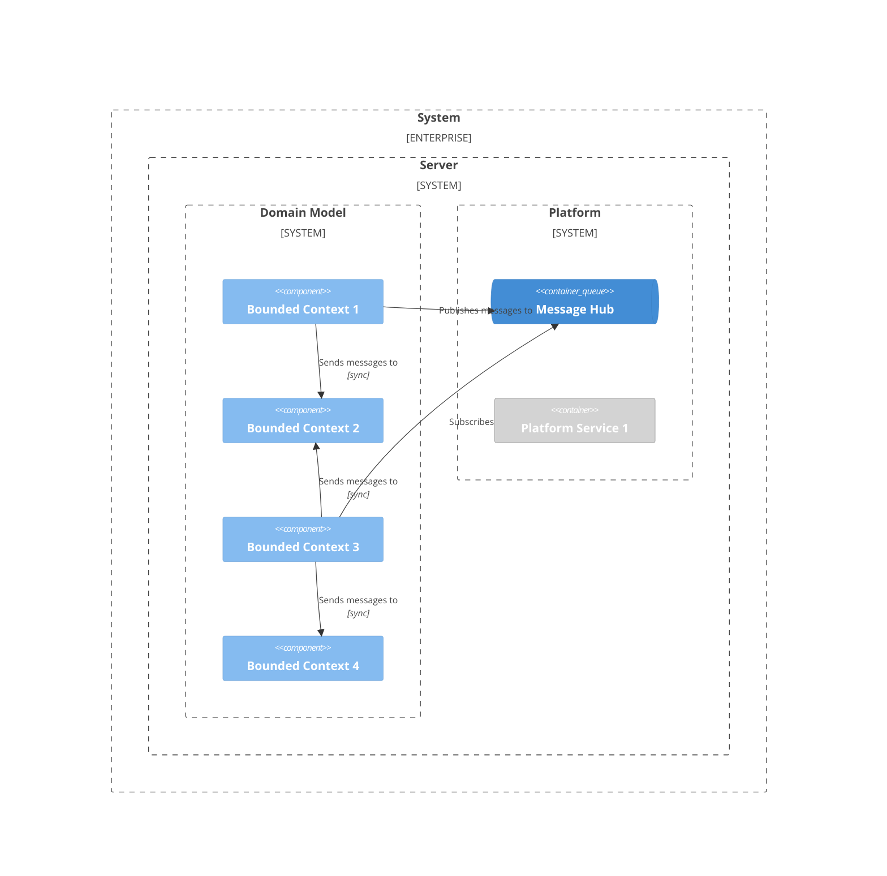

위 그림에서 Bounded Context 1은 Bounded Context 2에 동기적으로 메시지를 전달하는 반면, Bounded Context 1과 Bounded Context 3은 Message Hub를 통해 비동기적으로 메시지를 주고받으며 협력한다.

#### 플랫폼 서비스

플랫폼 서비스는 여러 Bounded Context에 의해 재사용되는 기술 집약적 기능을 제공한다. 예를 들어 전역 범위의 유일성을 보장하는 엔터티 식별자를 생성하거나 암호화 기능을 제공할 수 있다.


#### 레거시 시스템 사용

Bounded Context는 직접 비즈니스 도메인의 해법을 제공하는 것이 원칙이지만 현실적인 이유로 인해 해법 구현을 Legacy System에 위임할 수 있다. 예를 들어 Legacy System 자체는 폐기되었지만 포함된 기능 중 일부는 유용하고 재구현 비용이 비싸다면 Bounded Context의 인터페이스 설계에는 배제하되 구현에는 활용하는 것이 실용적일 수 있다.


#### 외부 서비스 사용

시스템을 외부 시스템과 통합하는 방법으로 공개 API 제공할 수도 있지만 반대로 외부 시스템이 제공하는 API를 Bounded Context가 사용할 수도 있다. 이때 Bounded Context의 모델은 외부 시스템에 직접 의존하지 않으며 추상화된 인터페이스를 통해 간접 의존한다.


### Bounded Context 구현

#### Bounded Context 구성

**기본 구성**

일반적으로 Bounded Context는 하나의 모델을 포함한다. 이 경우 Bounded Context는 주요 구성요소 Contracts, Model, Adapters를 갖는다.

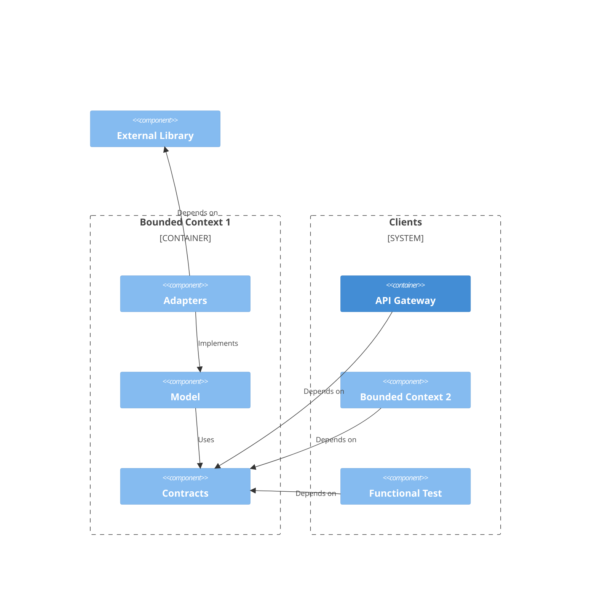

- **Contracts:** Bounded Context가 외부에 노출하는 인터페이스 계약에 사용되는 메시지와 데이터를 정의한다. Bounded Context의 직접 또는 간접 클라이언트는 오직 Contracts에 정의된 코드에만 직접 의존할 수 있다.

- **Model:** Bounded Context가 담당하는 도메인 모델이 표현된다. 문제 해법의 핵심 논리가 작성되며 전체 시스템 범위에서 가장 중요한 영역이다.

- **Adapters:** Model이 순수한 코드로 문제 해법을 구현할 수 있도록 기반 코드를 제공한다. 예를 들어 Model에 데이터 영속 장치에 대한 추상화가 정의되었다면 이 추상화의 구현체를 Adapters가 제공한다. Model이 다른 시스템에 의존할 때 의존 대상의 설계에 의해 Model이 훼손되지 않도록 [변질 방지 계층(Anti-Corruption Layer, ACL)](https://learn.microsoft.com/en-us/azure/architecture/patterns/anti-corruption-layer)이 포함될 수도 있다. 

Model과 Adapters의 역할과 관계를 이해하기 위해 주문을 조회하는 기능에 Repository 패턴이 사용된다고 생각해 보자. Model에 `OrderRepository` 인터페이스가 정의되고 `OrderQueryProcessor` 클래스가 `OrderRepository` 인터페이스에 의존해 `Order` 개체를 찾아 `OrderView` 개체로 변환해 반환하는 기능을 구현한다. Adapters는 외부 라이브러리가 제공하는 관계형 데이터베이스 드라이버를 사용해 `OrderRepository` 인터페이스를 구현한다. 이때 Model은 Adapters와 외부 라이브러리 어떤 것에도 의존하지 않기 때문에 적응력이 높아지고 테스트하기 쉬워진다.

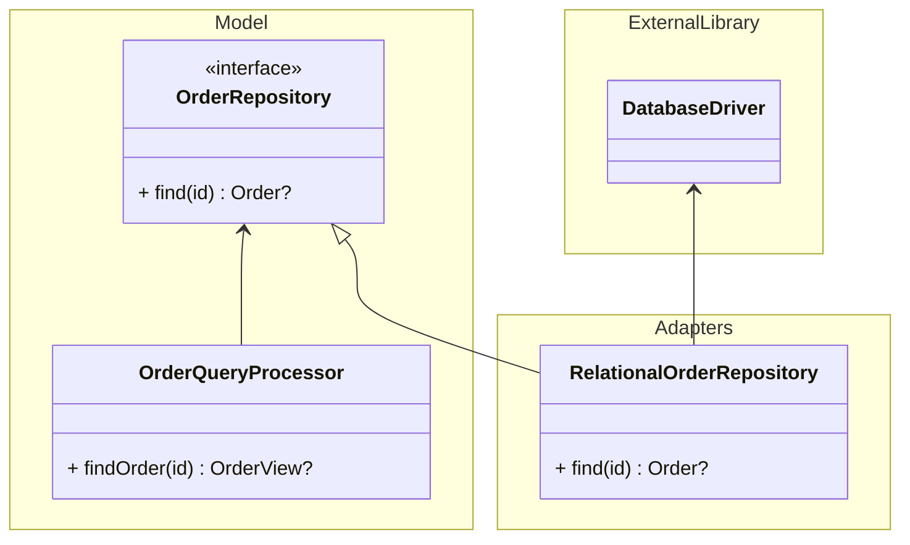

**CQRS(Command and Query Responsibility Segregation)**

Bounded Context의 모델에 CQRS 패턴이 적용되면 단일 모델 구성의 Model이 Command Model과 Query Model로 분리된다. Command Model은 도메인 모델의 명령 처리를, Query Model은 도메인 모델의 조회 처리를 표현한다.

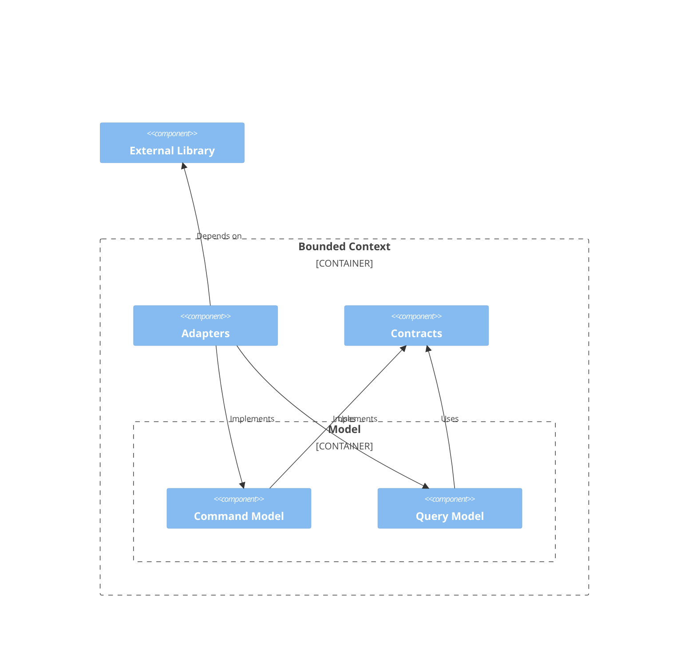

#### Bounded Context 호스팅

**단일 Bounded Context 호스팅**

Bounded Context는 Microservices 패턴에서와 같이 각각 하나의 독립된 호스트 응용프로그램에서 독립적으로 구동될 수 있다. 특정 Bounded Context에 대해 독립적으로 자원을 할당하고 출시 주기를 관리하거나 다른 Bounded Context의 장애로 인한 효과를 차단해야 할 때 적합하다. 하지만 코드 수준의 격리에 비해 호스팅 환경을 격리하는 것은 많은 관리비용을 요구하기 때문에 규모가 작은 조직에서는 신중하게 접근하는 것이 좋다.

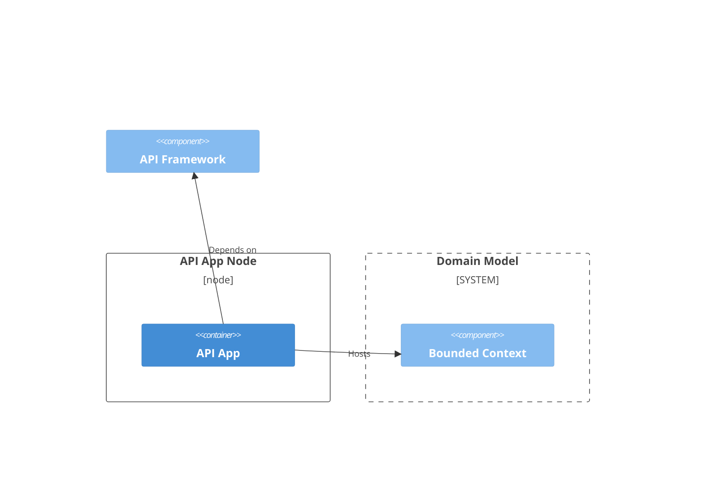

**공유 호스트 응용프로그램**

여러 Bounded Context가 하나의 호스트 응용프로그램에서 구동될 수 있다. 공유된 호스트 응용프로그램에서 호스팅되는 Bounded Context들은 런타임, CPU, 메모리, 네트워크, 가용성 등을 공유한다.

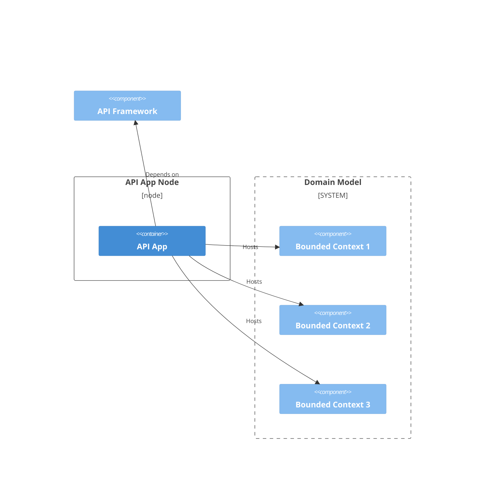

**다중 호스트 응용프로그램**

하나의 Bounded Context가 둘 이상의 응용프로그램에서 호스팅될 수 있다. 예를 들어 하나의 Bounded Context가 API 응용프로그램에서 호스팅되어 동기적으로 요청을 처리하며 동시에 메시지 처리 응용프로그램에서 호스팅되어 비동기적으로 요청을 처리하는 아키텍처도 가능하다.

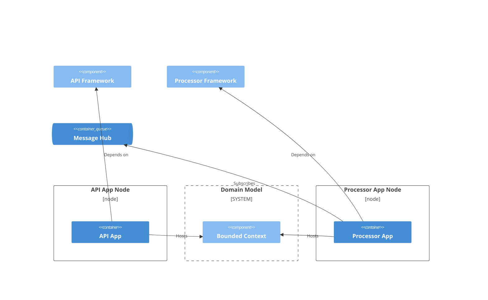
### 코드 디렉터리

시스템 아키텍처가 고려된 코드 디렉터리 구조는 아키텍처를 이해하고 관리하는 데 큰 도움이 된다. 예를 들어 쇼핑 서비스 시스템은 아키텍처를 반영해 코드 디렉터리를 아래와 같이 설계할 수 있다.

```text
root/
┣ server/
┃ ┣ domain-model/
┃ ┃ ┣ accounting/
┃ ┃ ┃ ┣ adapters/
┃ ┃ ┃ ┣ contracts/
┃ ┃ ┃ ┣ model/
┃ ┃ ┃ ┗ unit-tests/
┃ ┃ ┣ identity/
┃ ┃ ┃ ┣ adapters/
┃ ┃ ┃ ┣ contracts/
┃ ┃ ┃ ┣ model/
┃ ┃ ┃ ┗ unit-tests/
┃ ┃ ┣ inventory/
┃ ┃ ┃ ┣ adapters/
┃ ┃ ┃ ┣ contracts/
┃ ┃ ┃ ┣ model/
┃ ┃ ┃ ┗ unit-tests/
┃ ┃ ┣ orders/
┃ ┃ ┃ ┣ adapters/
┃ ┃ ┃ ┣ api/
┃ ┃ ┃ ┣ contracts/
┃ ┃ ┃ ┣ infrastructure/
┃ ┃ ┃ ┣ model/
┃ ┃ ┃ ┣ processor/
┃ ┃ ┃ ┗ unit-tests/
┃ ┃ ┗ shared-hosts/
┃ ┃   ┣ api/
┃ ┃   ┣ infrastructure/
┃ ┃   ┣ processor/
┃ ┃   ┗ unit-tests/
┃ ┣ gateway/
┃ ┃ ┣ administration-bff/
┃ ┃ ┃ ┣ api/
┃ ┃ ┃ ┣ infrastructure/
┃ ┃ ┃ ┗ unit-tests/
┃ ┃ ┣ api-gateway/
┃ ┃ ┃ ┣ api/
┃ ┃ ┃ ┣ infrastructure/
┃ ┃ ┃ ┗ unit-tests/
┃ ┃ ┣ functional-tests/
┃ ┃ ┣ seller-bff/
┃ ┃ ┃ ┣ api/
┃ ┃ ┃ ┣ infrastructure/
┃ ┃ ┃ ┗ unit-tests/
┃ ┃ ┗ shopper-bff/
┃ ┃   ┣ api/
┃ ┃   ┣ infrastructure/
┃ ┃   ┗ unit-tests/
┃ ┗ platform/
┃   ┣ api/
┃   ┣ infrastructure/
┃   ┣ processor/
┃   ┗ unit-tests/
┗ ui/
  ┣ administration-frontend/
  ┃ ┗ web/
  ┣ seller-frontend/
  ┃ ┗ web/
  ┗ shopper-frontend/
    ┣ android/
    ┣ ios/
    ┗ web/
```

#### `domain-model` 디렉터리

Domain Model 영역 코드를 담는다.

```text
domain-model/
┣ accounting/
┣ identity/
┣ inventory/
┣ orders/
┃ ┣ api/
┃ ┗ processor/
┗ shared-hosts/
  ┣ api/
  ┗ processor/
```

사례에서 `domain-model` 디렉터리는 정산을 담당하는 Accounting Bounded Context, 계정 관리를 담당하는 Identity Bounded Context, 상품 인벤토리를 담당하는 Inventory Bounded Context, 주문 관리를 담당하는 Order Bounded Context의 코드를 담으며 여러 Bounded Context를 호스팅하는 공유 API 호스트 응용프로그램과 공유 메시지 처리 호스트 응용프로그램이 포함된다. Accounting Bounded Context와 Identity Bounded Context, Inventory Bounded Context는 공유 호스트 응용프로그램에서 호스팅되며 Order Bounded Context는 전용 호스트 응용프로그램이 사용된다.

#### `infrastructure` 디렉터리

각 아키텍처 구성요소에 필요한 컴퓨팅 자원을 배치하는 IaC(Infrastructure as Code)를 담는다.

## 코드 스트림

소스 코드 형상의 변경 내역을 스트림으로 바라보는 모델은 여러 프로그래머가 협업할 때 필요한 관리비용을 줄여준다. 모든 팀 구성원이 코드에 담긴 지식에 쉽게 접근하고 분산된 작업 결과물을 안전하게 조립할 수 있다.

### 단일 저장소 전략

많은 개발 조직이 시스템 구성요소들을 수많은 개별 코드 저장소로 분해해 관리하며 이런 팀 중 대다수는 이것이 유일한 방법인 것으로 착각한다. 특히 서버 코드와 UI 클라이언트 코드를 하나의 저장소에 모아 두면 금새 종말이라도 찾아올 거라고들 상상한다. 하지만 그런 일은 전혀 일어나지 않는다. 잠깐만 사고실험을 해봐도 알 수 있다. 작은 조직은 코드 저장소를 하나로 통합할 때 오히려 이점이 크다. 또한 Google, Facebook 등 거대기업이 단일 저장소를 사용하는 사례도 찾기 어렵지 않다. 단일 저장소 전략은 최근에 등장한 개념이 아닌 오랫동안 사용되어 온 기법이다.

단일 저장소 전략의 장점은 다음과 같다.

1. **투명성:** 시스템의 모든 코드가 한 곳에 모여있기 때문에 비즈니스 프로세스 전체를 구현하는 코드를 누구나 빠르게 검색하고 이해할 수 있다. 개발자는 자신의 코드 수정이 야기할 여파를 예측하거나 다른 동료에 의해 작성된 의존 코드를 검사해 오류의 원인을 추적할 수 있게 된다. 예를 들어 자신의 개발 장비에서, 웹 프론트엔드 프로그래머는 서버 내부 구현을 조사할 수 있고 서버 프로그래머는 API 클라이언트의 사용 의도를 파악할 수 있다.

2. **변경 집합의 무결성:** 원자성을 갖는 코드 변경 집합에 비즈니스 가치 제공을 위한 코드 수정과 이 변경에 영향받는 코드의 대응을 함께 담을 수 있다. 개발팀은 변경 집합의 무결성을 통해 코드 스트림을 안전하게 보호할 수 있다.

3. **특정 시점의 전체 시스템 형상 확인:** 전체 시스템의 변경이 하나의 코드 스트림으로 표현되기 때문에 쉽 과거 특정 시점의 코드를 읽고 구동시켜 테스트할 수 있다.

4. **일관된 설계 개선:** 더 나은 설계 정책을 일관되게 적용하기 쉬워진다.

5. **표준화된 규칙 유지:** 권장되는 코드 작성과 코드 저장소 운영, 파이프라인 관리 등의 규칙을 시스템 전체 수준에서 표준화하고 관리할 수 있다. 이를 통해 관리비용이 절감되어 효율적으로 적정 수준의 코드 품질을 유지할 수 있다.

### Fast-Forward 스트림

Git을 사용해 형상을 관리하는 전략은 다양하며 각 전략은 각자의 특징을 갖는다. 코드 스트림인 `main` 브랜치의 코드 변경을 다른 분기의 간섭이 없는 fast-forward 스트림으로 관리하면 코드의 변화가 극도로 단순해지기 때문에 코드의 역사를 이해하기 쉬워진다. 병합 지옥에서 벗어나고 코드 충돌 가능성이 줄어든다. 코드 형상으로 구현되는 시스템의 각 구성요소는 복잡한 의존성 버전 관리 없이 최신 상태를 유지할 수 있다. 새로운 합류한 팀원은 복잡한 브랜칭 전략을 배울 필요 없이 즉시 간단한 작업을 시작하고 완료 후 릴리스할 수 있다.

만약 코드를 쓰는 팀 내 모든 엔지니어가 작고 원자적이고 검증된 코드 변경에 숙련되어 [지속 통합(Continuous Integration)](https://www.notion.so/Continuous-Integration-6da6ddf312614b33a6d36236bb2fb40c?pvs=21) 또는 [Trunk-Based Development](https://trunkbaseddevelopment.com/)를 사용하기 되면 여러가지 효과를 얻을 수 있는데 그 중 하나로 fast-forward 코드 스트림 유지가 자연스러워진다.

#### Fast-Forward 스트림 기반 협업 사례

Fast-Forward 스트림을 사용하는 팀이 협업하는 가상의 사례를 설명한다. 이런 작업은 실제로는 프로그래머가 직접 처리하기 보다 GitHub의 ['Allow rebase merging'](https://docs.github.com/en/repositories/configuring-branches-and-merges-in-your-repository/configuring-pull-request-merges/configuring-commit-rebasing-for-pull-requests)과 같은 코드 저장소 관리 도구를 이용하는 것이 일반적이다.

1. `main` 브랜치에서 `work-1` 브랜치와 `work-2` 브랜치를 분기한다.

    ```mermaid
    gitGraph
      commit id: "1-M"
      commit id: "2-M"
      branch work-1
      branch work-2
    ```

2. `main` 브랜치에 다른 경로에 의해 `3-M` 커밋이 추가된다.

    ```mermaid
    gitGraph
      commit id: "1-M"
      commit id: "2-M"
      branch work-1
      branch work-2
      checkout main
      commit id: "3-M"
    ```

3. `work-1` 브랜치에 `4-W` 커밋과 `5-W` 커밋을 추가한다.

    ```mermaid
    gitGraph
      commit id: "1-M"
      commit id: "2-M"
      branch work-1
      branch work-2
      checkout main
      commit id: "3-M"
      checkout work-1
      commit id: "4-W"
      commit id: "5-W"
    ```

4. `work-2` 브랜치에 `6-W` 커밋을 추가한다.

    ```mermaid
    gitGraph
      commit id: "1-M"
      commit id: "2-M"
      branch work-1
      branch work-2
      checkout main
      commit id: "3-M"
      checkout work-1
      commit id: "4-W"
      commit id: "5-W"
      checkout work-2
      commit id: "6-W"
    ```

5. `work-1` 브랜치를 `main` 브랜치에 리베이스한다. 기존 `4-W` 커밋과 `5-W` 커밋은 각각 `4-M` 커밋과 `5-M` 커밋으로 교체된다.

    ```mermaid
    gitGraph
      commit id: "1-M"
      commit id: "2-M"
      branch work-2
      checkout main
      commit id: "3-M"
      branch work-1
      checkout work-1
      commit id: "4-M"
      commit id: "5-M"
      checkout work-2
      commit id: "6-W"
    ```

6. `work-1` 브랜치를 `main` 브랜치에 fast-forward 병합한다.

    ```mermaid
    gitGraph
      commit id: "1-M"
      commit id: "2-M"
      branch work-2
      checkout main
      commit id: "3-M"
      commit id: "4-M"
      commit id: "5-M"
      branch work-1
      checkout work-2
      commit id: "6-W"
    ```

7. `main` 브랜치에 병합된 `work-1` 브랜치를 삭제한다.

    ```mermaid
    gitGraph
      commit id: "1-M"
      commit id: "2-M"
      branch work-2
      checkout main
      commit id: "3-M"
      commit id: "4-M"
      commit id: "5-M"
      checkout work-2
      commit id: "6-W"
    ```

8. `work-2` 브랜치를 `main` 브랜치에 리베이스한다. 기존 `6-W` 커밋은 `6-M` 커밋으로 교체된다.

    ```mermaid
    gitGraph
      commit id: "1-M"
      commit id: "2-M"
      commit id: "3-M"
      commit id: "4-M"
      commit id: "5-M"
      branch work-2
      checkout work-2
      commit id: "6-M"
    ```

9. `work-2` 브랜치를 `main` 브랜치에 fast-forward 병합한다.

    ```mermaid
    gitGraph
      commit id: "1-M"
      commit id: "2-M"
      commit id: "3-M"
      commit id: "4-M"
      commit id: "5-M"
      commit id: "6-M"
      branch work-2
    ```

10. `main` 브랜치에 병합된 `work-2` 브랜치를 삭제한다.

    ```mermaid
    gitGraph
      commit id: "1-M"
      commit id: "2-M"
      commit id: "3-M"
      commit id: "4-M"
      commit id: "5-M"
      commit id: "6-M"
    ```

### 테스트 기법

#### 단위 테스트(Unit Test)

시스템을 구성하는 코드의 일부를 격리시켜 테스트한다. 단위 테스트는 작성 및 실행 비용이 싸고 테스트 결과가 안정적인 반면 성공적인 클라이언트 경험 설명력이 높지 않다.

#### 기능 테스트(Functional Test)

코드를 실행 가능한 형태로 빌드하고 실행환경에 배치한 후 공개된 인터페이스를 통해 클라이언트의 시각에서 테스트한다. 실행환경은 로컬 환경, 테스트 환경, 스테이징 환경, 운영 환경 등이 있다. 기능 테스트는 작성 및 실행 비용이 비싸고 다양한 요인에 의해 테스트 오류([1종 오류](https://gyuwon.github.io/blog/2018/12/19/false-positive-in-software-testing.html)나 2종 오류)가 발생할 가능성이 존재하지만 성공적인 클라이언트 경험 설명력이 높다.

### 지속 통합(Continuous Integration)

지속 통합은 팀의 모든 코더가 짧은 주기로 단일 통합 지점에 안전한 코드를 추가하는 기법이다. 프로그래머는 자신의 로컬 개발 장비에서 코드를 작성하고 동작을 검증한 후 Pull Reques를 통해 동료의 리뷰와 테스트를 거쳐 단일 통합 지점인 코드 스트림에 코드를 추가한다.

Martin Fowler는 [Continuous Integration Certification (martinfowler.com)](https://martinfowler.com/bliki/ContinuousIntegrationCertification.html) 에서 지속 통합 인증 기준으로 다음을 제시했다.

1. Every developer commits at least daily to the shared mainline
2. Every commit triggers an automated build and test
3. If build and test fails, it's repaired within ten minutes

참고자료

- [It's not CI, it's just CI Theatre | GoCD Blog](https://www.gocd.org/2017/05/16/its-not-CI-its-CI-theatre.html)
- [Continuous Integration (martinfowler.com)](https://martinfowler.com/articles/continuousIntegration.html)

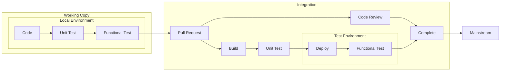

### 파이프라인

작업 복사본 코드 형상이 코드 스트림에 병합되면, 즉 코드 스트림에 코드 변경이 추가되면, 변경 내용에 해당하는 조건을 가진 트리거가 파이프라인을 실행시킨다. 일반적으로 시스템의 각 구성요소는 디렉터리로 구분되기 때문에 디렉터리 경로 조건에 의해 트리거가 발동하는 경우가 많다. 각 파이프라인은 [지속 배치(Continuous Deployment)](https://www.notion.so/Continuous-Deployment-d114471c3b4e4ba68c703fbd6cd019e8?pvs=21) 또는 [지속 배달(Continuous Delivery)](https://www.notion.so/Continuous-Delivery-e05cc292b5984e83be3113840f0433a1?pvs=21) 과정을 담는다.

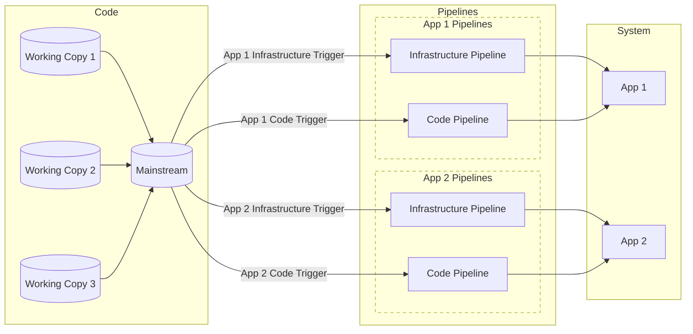

### 지속 배치(Continuous Deployment)

지속 배치는 단일 통합 지점의 모든 변경을 자동으로 출시한다. 변경된 코드 형상은 빌드되어 아티팩트가 생성되고 아티팩트는 단위 테스트된 후 아티팩트 저장소에 저장된다. 스테이징 환경 배치와 운영 환경 배치에 코드 형상은 다시 빌드되지 않으며 아티팩트 저장소에 저장된 아티팩트가 그대로 사용된다. 스테이징 환경은 내부에서만 접근할 수 있는 운영 환경의 일부다. 스테이징 환경과 운영 환경 배치에는 [Blue-Green 배치](https://docs.aws.amazon.com/whitepapers/latest/overview-deployment-options/bluegreen-deployments.html) 또는 [카나리 배치](https://wa.aws.amazon.com/wellarchitected/2020-07-02T19-33-23/wat.concept.canary-deployment.en.html) 등의 기법이 사용될 수 있다. 자동화된 테스트 만으로 높은 안정적 작동의 신뢰를 얻을 수 있는 API 응용프로그램에 자주 사용된다.

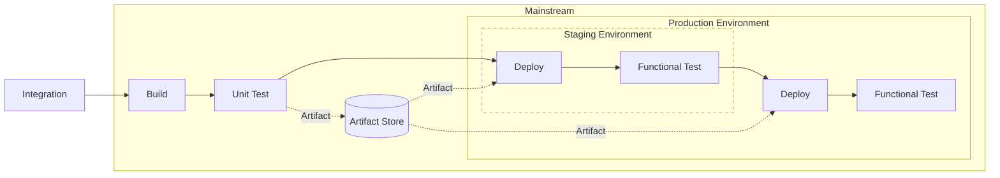

### 지속 배달(Continuous Delivery)

지속 배달은 지속 배치와 아주 유사하다. 핵심 차이는 스테이징 환경 검증 이후 운영 환경 배치에 수동 승인 절차가 포함된 점이다. 지속 배달을 사용하면 단일 통합 지점의 모든 변경에 대해 배치 가능한 아티팩트가 준비되지만 이 아티팩트를 고객과의 접점에 배치할 지 여부는 개발팀의 정책에 의해 결정된다. 예를 들어 Product Owner나 QA 엔지니어가 출시를 결정할 수 있다. 자동화된 테스트 만으로는 높은 안정적 작동의 신뢰를 얻을 수 없거나 가치 전달 단위와 코드 변경 단위가 일치하지 않을 때 고객경험을 해칠 수 있는 UI 응용프로그램에 자주 사용된다.

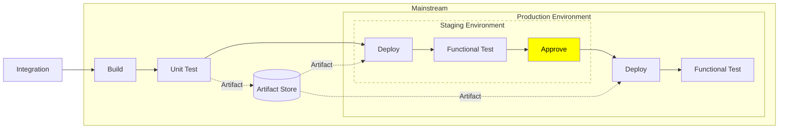
